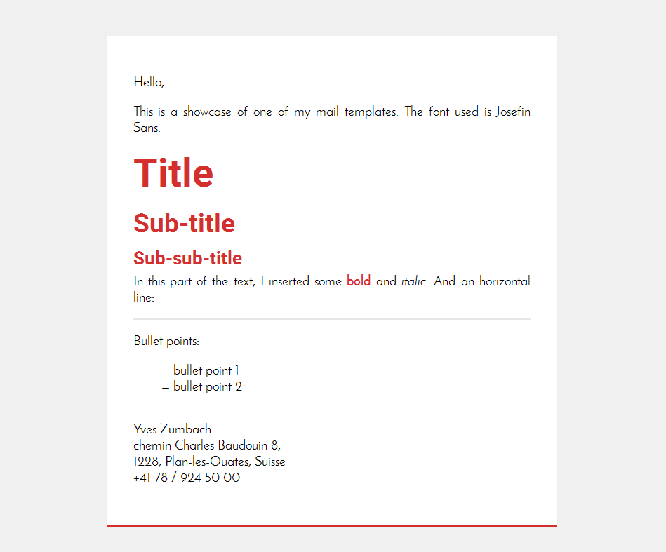

# Email Templates
Email templates are HTML source code that allow you to create beautiful emails, like the ones you receive from websites or companies.

They are really easy to create and customize if you know HTML and CSS! Don't miss this easy opportunity!!!

Email template example:

## Disclaimer
This small kind-of-tutorial is written with open source in mind. It target Thunderbird as it is the mailer I use and it is open. If you use a different mailer, you might very well find documentation on the web.

The HTML files in this folder are templates. You can use them under the term of the CC-BY-NC licence. This means that they are free, that you can freely share them, modify them and share them as long as you provide credits for it and don't make commercial use of this work.

Follow the next steps to know how to make them work.

##Prerequisites
First, you will need to configure your mailer to send HTML emails, not plain text ones.

Open Thunderbird, then go to Tools -> Account Settings -> your mail adress -> Composition & Addressing and make sure *Compose messages in HTML format* is selected.

You can know compose your emails as if they were websites!

## Inserting HTML in your mails

To add HTML code to an email when you are writing it, go to Insert -> HTML. If you want to modify some HTML code you already inserted, select the whole text using Ctrl+A then Insert -> HTML.

## Easing your life with templates

If you want to ease your life and avoid the tidious task of writing HTML code each time you write an email, here is the solution I came up with.

First, install the Quicktext plugin for Thunderbird. To do that, open Thunderbird add-on menu. Search Quicktext and install the plugin. You will then find a Quicktext entry in the Tools menu.

Open Quicktext and add a group called firstTemplate. Then add an entry to that group. In the editor, add some HTML code in the text editor (you could use one of the templates provided in this repo for example[^1]). And you're done!!!

A new button will appear from now on when you write an email. Simply click it and Quicktext will add the HTML code to the email.

**If you use one of my template, be sure to click on the template button *before* starting to write the email content!**

## Copyright

 This work is licensed under a <a rel="license" href="http://creativecommons.org/licenses/by-nc/4.0/">Creative Commons Attribution-NonCommercial 4.0 International License</a>.

[^1]: If you use one of my templates, don't forget to change the default signature values.